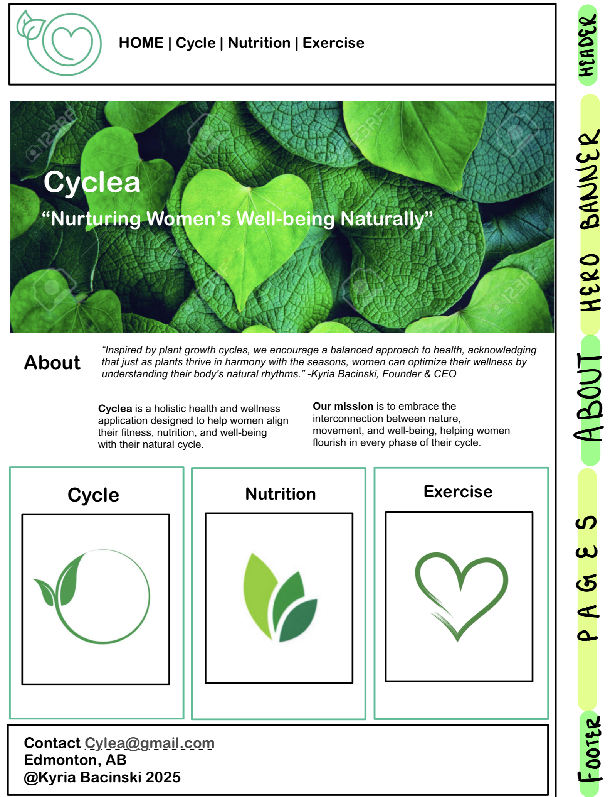
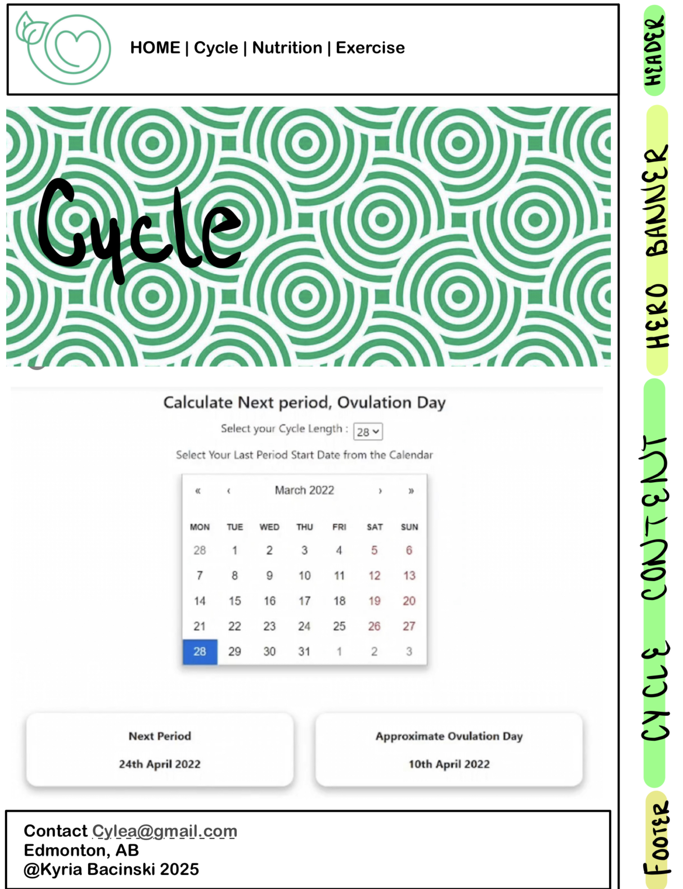
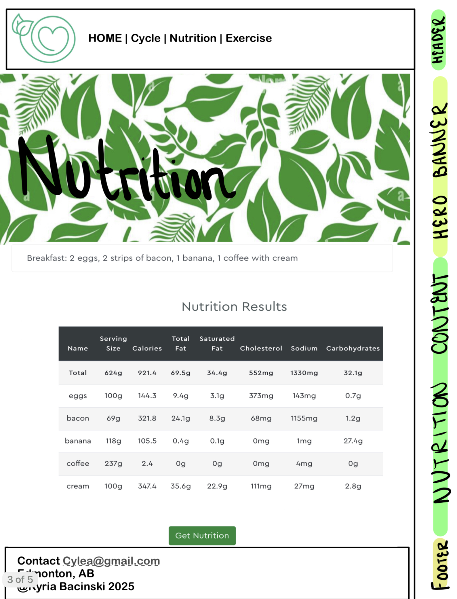
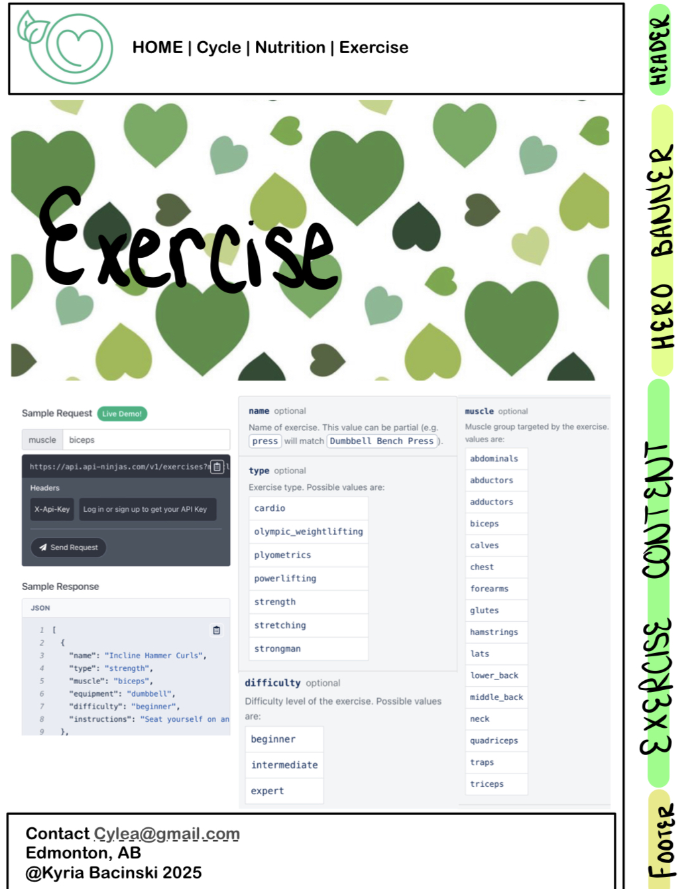

# Cyclea

## Overview 
"Nurturing Women's Well-being Naturally"

- Cyclea is a holistic health and wellness application designed to help women align their fitness, nutrition, and well-being with their natural cycle. 
- Inspired by nature and plant growth cycles, Cyclea encourages a balanced approach to health, acknowledging that just as plants thrive in harmony with the seasons, women can optimize their wellness by understanding their body's natural rhythms. 
- Our mission is to embrance the interconnection between nature, movement, and well-being, helping women flourish in every phase of their cycle.

## Steps to Set-up the Website in Vite
1. Clone the Repository
Open your terminal and run:
git clone <https://github.com/kyria-b/kyria-bacinski-capstone-cyclea.git>

2. Navigate to the Project Folder:
cd kyria-bacinski-capstone-cyclea 

3. Install Dependencies
Since Vite uses npm, install the required packages:
npm install

4. Start the Vite Development Server
Run the following command to start the local development server:
npm run dev

5. Open the Website in Your Browser
After running npm run dev, Vite will display a local server URL like:
http://localhost:5173
Open this link in your browser to view the website.

### Problem

- Women’s health is often approached with a one-size-fits-all mindset, neglecting the natural hormonal fluctuations that influence energy levels, metabolism, and overall well-being. 
- Many women experience frustration with workout regimens that do not account for these changes, leading to burnout, ineffective results, and discomfort. 
- Cyclea addresses this gap by providing personalized workout and nutrition recommendations that sync with the phases of the menstrual cycle, promoting a more sustainable and intuitive approach to wellness.

### User Profile
- Target Users: Women looking to optimize their fitness and wellness in harmony with their cycle.
- Usage: Users will log their cycle phase, receive tailored workout, nutrition, and wellness suggestions, track progress, and gain insights into their well-being.
- Special Considerations: The app must prioritize user privacy and sensitivity around menstrual health data. A simple, nurturing, and intuitive UI will enhance the user experience, making it accessible for users of all backgrounds.

### Features

- Cycle Tracker: Users can log and track their menstrual cycle phases (Follicular, Ovulation, Luteal, Menstrual). MVP - user will be told when their next period is based on their cycle length.

- Nutrition Guidance: Food recommendations based on hormonal fluctuations to support optimal health. MVP - user will be able to search up nutrition facts related to you meals that you input into the search bar.

- Personalized Fitness Plans: Workouts tailored to different cycle phases, considering energy levels and recovery needs. MVP - user will be able to search up exercises related to the body part that they input into the search bar it will give response of name, difficulty, and instructions.

## Implementation 
### Tech Stack
Frontend: React, react-router-dom
Backend: Node.js, Express
Database: MySQL, Knex
Styling: BEM/SASS
API Testing: Postman
Other Tools: npm, browser development tools

### APIs 
Custom API: The RESTful API will serve for handling user authentication and cycle tracking.
External APIs (Potential Integrations):
Menstrual Cycle Calendar implmentation idea: https://www.geeksforgeeks.org/ovulation-day-and-next-period-calculator-in-react-js/  
Nutrition API: https://spoonacular.com/food-api/
Exercise API: https://www.api-ninjas.com/api/exercises 

### Sitemap

- Home
- Cycle
- Nutrition
- Exercise

* User Profile: User settings, cycle log, and customization options.
Home: Introduction to Cyclea and its about section with clickable icons that lead to pages.
- Home: Home page will include an about section and directory to the other 3 pages below:
- Cycle: Personalized cycle phase insights into when next expected peiod.
- Nutrition: Phase-based dietary guidance and meal suggestions and gives the calories that are inputted.
- Exercise: Suggested fitness routines based on the user's cycle phase and gives instructions and difficulty and type of exercise.

### Mockups 

Initial mockups will be created using goodnotes and images from google, featuring a nature-inspired color palette and soft, organic UI elements to reinforce the theme of natural well-being.

### Home Page 

### Cycle page 

### Nutrition Page

### Exercise Page

## Data

- Users Table: Stores user details and preferences.
- Cycle Phases Table: Tracks cycle phase logs.
- Nutrition Table: Stores suggested meals and nutrients aligned with cycle needs.
- Exercise Table: Contains recommended exercises based on cycle phase.

### Endpoints

### POST /api/users/register
Register a new user
Parameters:
- email (string): User's email
- password (string): User's provided password
- username (string): Chosen display name

### POST /api/users/login 
Authenticate user and log in
Parameters:
- email (string): User's email
- password (string): User's provided password

### GET /api/users/profile/:id 
Get user profile details
Parameters:
- id (integer): User ID
Response:
{
    "id": 1,
    "username": "wellnesswarrior",
    "email": "user@example.com",
    "created_at": "2025-02-12T12:00:00Z"
}

### PUT /api/users/profile/:id 
Update user cycle phase
Parameters:
- id (integer): User ID

Response:
{
    "phase": "Luteal",
    "next_period_date": "2025-03-01"
}
{
    "message": "Cycle phase updated successfully"
}

### GET /api/workouts/:phase
Retrieve workouts based on the user’s cycle phase
Parameters:
- phase (string): Cycle phase (Follicular, Ovulation, Luteal, Menstrual)

Response: [
    {
        "id": 1,
        "name": "Yoga Flow",
        "difficulty": "Easy",
        "type": "Yoga"
    },
    {
        "id": 2,
        "name": "Strength Training",
        "difficulty": "Medium",
        "type": "Strength"
    }
]

### POST /api/workouts/add
Allow users to log completed workouts
Body:
{
    "workout_id": 1,
    "completed_at": "2025-02-12T14:30:00Z"
}
Response: 
{
    "message": "Workout logged successfully"
}

### GET /api/nutrition/:phase
Get nutrition suggestions for a cycle phase
Parameters:
- phase (string): Cycle phase (Follicular, Ovulation, Luteal, Menstrual)
Response:

[
    {
        "id": 1,
        "food_name": "Avocado",
        "calories": 160,
        "phase": "Luteal"
    },
    {
        "id": 2,
        "food_name": "Salmon",
        "calories": 208,
        "phase": "Follicular"
    }
]

### Roadmap 
## Sprint 1: Core Features & Setup [FEB 12 - FEB 16 (5 days)]
Project Setup
- Initialize project repository 
    - frontend
    - backend
- Install dependencies
    - React
    - Express
    - Knex
    - MySQL
- Set up routing in React and Express with placeholder responses
Database & API Foundation
- Plan database schema and create Knex migrations
- Seed database with sample data 
    - users
    - exercise
    - nutrition
Implement API endpoints for:
- User registration & login
- Cycle tracking
- Workouts & nutrition suggestions
Frontend Core UI
- Build foundational UI components 
    - header
    - footer
    - navigation
    - forms
- Create cycle tracking UI (basic layout & state management)
- Integrate frontend with backend API
## Sprint 2: Feature Development & Integration [FEB 17 - FEB 20 (4 days)]
Cycle Tracking & Recommendations
- Develop cycle tracking feature 
    - frontend integration
    - backend integration
- Implement user progress tracking 
    - nutrition
    - logging exercise
- Display cycle phase-based recommendations 
    - nutrition
    - exercise
User Experience Enhancements
- Refine UI/UX
- responsiveness
- accessibility
Optimize performance 
    - API requests
    - state management
- Implement error handling & validation
## Sprint 3: Testing, Deployment & Finalization [FEB 21 - FEB 23 (3 days)]
Testing & Bug Fixes
- Conduct unit and integration testing for all core features
- Fix bugs & optimize backend queries
Deployment & Documentation
- Deploy backend
- Deploy frontend 
- Prepare documentation & presentation materials
- Final QA testing before launch

## Nice-to-haves
## Future Implementations
Sitemap/pages 
- Progress: Visualization of trends over time.
User Profile section
- Create registration and login pages for the user information to be saved
- Develop progress tracking and visualization tools
- Community forum pages where people can leave comments and provide feedback
- Implement mental health api that gives wellness tips

